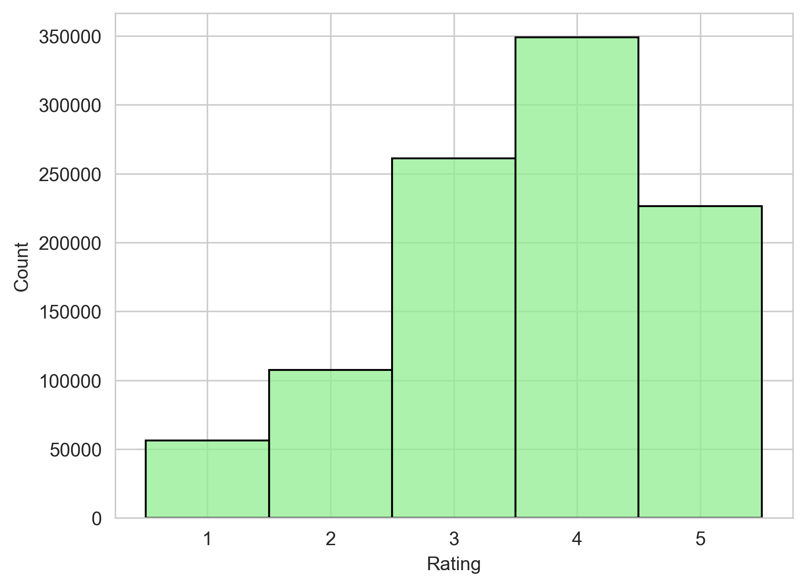
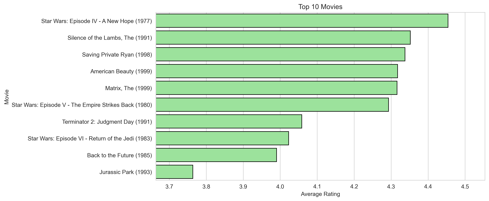

# 🎬 Movie Recommendation System – Data Science Project

## 📌 Overview

This project explores the **MovieLens 1M dataset** to analyze user behavior, movie characteristics, and build a **hybrid recommendation system**.

It combines:

* Exploratory Data Analysis (EDA)
* Feature Engineering
* Machine Learning models
* Collaborative Filtering

The goal is to **predict movie ratings** and **recommend similar movies based on user preferences**.

---

## 📂 Dataset

The dataset consists of three main files:

* **Users**: demographic information
* **Movies**: titles and genres
* **Ratings**: user ratings for movies

These were merged into a single dataset to enable deeper analysis.

---

## 🔍 Exploratory Data Analysis

### Ratings Distribution

* Ratings range from 1 to 5
* Distribution is skewed toward higher ratings
  👉 Users tend to rate movies positively

### Top Movies

* Ranking based on:

  * Number of ratings (popularity)
  * Average rating (quality)
  👉 This avoids bias from movies with very few ratings

---

## ⚙️ Feature Engineering

A hybrid feature set was created combining:

### 1. User Behavior

* Average rating per user
  👉 Captures user bias (some rate higher/lower)

### 2. Movie Popularity

* Average rating per movie
  👉 Captures overall quality perception

### 3. Content Features

* Genres transformed into binary variables using:

  * MultiLabelBinarizer

👉 Enables machine learning models to interpret categorical data

---

## 🤖 Machine Learning Models

Two models were implemented using Scikit-learn:

### Linear Regression

* Simple baseline model
* Assumes linear relationships

### Random Forest Regressor

* Captures non-linear patterns
* Handles interactions between features

---

## 📊 Model Performance

| Model             | RMSE | MAE  |
| ----------------- | ---- | ---- |
| Linear Regression | 0.93 | 0.74 |
| Random Forest     | 1.00 | 0.78 |

### 🔎 Key Insight

Despite being simpler, **Linear Regression outperformed Random Forest**.

👉 Interpretation:

* Relationships in the data are mostly linear
* Added complexity did not improve generalization

---

## 🎯 Recommendation System

A **collaborative filtering approach** was implemented:

### Steps:

1. Created a user-item matrix
2. Selected a reference movie (*Star Wars: Episode IV*)
3. Computed correlations with other movies
4. Filtered by minimum number of ratings (>100)

### Example Output:

* Star Wars V
* Star Wars VI
* Raiders of the Lost Ark
* Dracula (1958)

👉 The system successfully recommends **thematically and behaviorally similar movies**

---

## 🚀 Future Improvements

* Implement:

  * Matrix Factorization (SVD)
  * Neural Recommender Systems
* Add user-based recommendations:

  * “Top 5 movies for a specific user”

---

## 🛠️ Tech Stack

* Python
* Pandas
* NumPy
* Seaborn
* Matplotlib
* Scikit-learn

---

## 📎 Author

Breno Larocerie Zamponi
